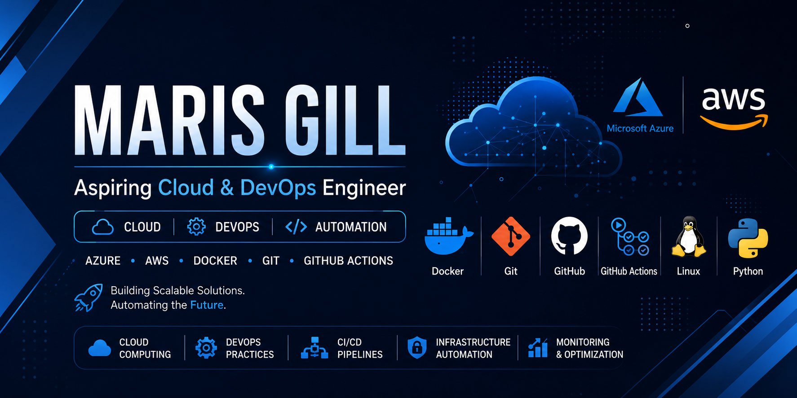

<p align="center">
  
</p>

<h1 align="center">☁️ Maris Gill</h1><p align="center">
  
</p>

<h1 align="center">👋 Hi, I'm Maris Gill</h1>

<h3 align="center">☁️ Aspiring Cloud & DevOps Engineer</h3>

<p align="center">
Cloud • DevOps • Automation • Azure • AWS • Docker • CI/CD
</p>

<p align="center">

</p>

---

# 🚀 Welcome

Welcome to my **Cloud & DevOps Portfolio**.

I am a **Bachelor of Science in Computer Science (BSCS)** student passionate about **Cloud Computing, DevOps, Automation, Infrastructure Management, and Modern Deployment Practices**.

I enjoy building real-world cloud projects using **Microsoft Azure, AWS, Docker, GitHub Actions, CI/CD, Linux, and Python** while continuously expanding my practical knowledge.

---

# 👨‍💻 About Me

- 🎓 BS Computer Science Student
- 🏫 Virtual University of Pakistan
- ☁️ Aspiring Cloud & DevOps Engineer
- 🚀 Passionate about Cloud Infrastructure & Automation
- 🐳 Docker & Containerization Enthusiast
- ⚙️ Learning Kubernetes & Terraform
- 📍 Lahore, Pakistan

---

# 🛠️ Tech Stack

<p align="center">


</p>

---

# ☁️ Cloud Platforms

## Microsoft Azure

- Azure Virtual Machines
- Azure Storage
- Azure Virtual Network (VNet)
- Network Security Groups (NSG)
- Azure Load Balancer
- VM Scale Sets
- Azure Monitor
- RBAC
- Azure Governance

---

## Amazon Web Services (AWS)

- AWS Cloud Fundamentals
- Compute Services
- Storage Services
- Networking
- Security
- Monitoring & Governance
- AWS Well-Architected Framework

---

# 🚀 DevOps Skills

- Git
- GitHub
- GitHub Actions
- Docker
- Docker Compose
- CI/CD Pipelines
- Linux
- Bash Scripting

---

# 💻 Programming

- Python
- Flask
- Node.js
- JavaScript
- HTML5
- CSS3

---

# 🧰 Tools

- Visual Studio Code
- Docker Desktop
- Git Bash
- GitHub
- Postman

---

# 📂 Featured Projects

| Project | Description |
|---------|-------------|
| 📚 Smart Library Management System | Version Control & Git Workflow Project |
| 🐳 Dockerized Node.js Application | Docker, Docker Compose & Containerization |
| 🔄 CI/CD Pipeline | GitHub Actions Automation |
| ⚙️ Complete DevOps Infrastructure | Docker Compose + GitHub Actions |
| ☁️ Cloud & DevOps Portfolio | Professional Portfolio Repository |

---

# 📜 Certifications & Learning

## ☁️ Amazon Web Services (AWS)

### AWS Training

- ✅ AWS Cloud Practitioner Essentials (Official Certificate)
- ✅ AWS Skill Builder Learning Badge

### Learning Areas

- AWS Compute
- AWS Storage
- AWS Networking
- AWS Security
- AWS Monitoring
- AWS Pricing
- AWS AI & Machine Learning
- AWS Well-Architected Framework
- AWS Specialized Services

---

## 🔷 Microsoft Azure Learning Badges

| Learning Module | Status |
|-----------------|--------|
| Cloud Computing | ✅ |
| Core Architectural Components | ✅ |
| Cloud Infrastructure | ✅ |
| Compute & Networking | ✅ |
| Azure Management | ✅ |
| Identity, Access & Security | ✅ |
| Governance & Compliance | ✅ |

---

## 🎓 Professional Programs

### TEVTA

Certified Cloud Dev Associate Program

Topics Covered:

- Azure Fundamentals
- Virtual Machines
- Azure Storage
- Azure Networking
- Identity & Security
- Monitoring & Governance

---

### DevAlpha Technologies

**DevOps Internship**

Completed:

- ✅ Version Control Workflow
- ✅ CI/CD Pipeline
- ✅ Dockerized Node.js Application
- ✅ Complete DevOps Infrastructure

---

### DevFest AmplifAI

Cloud & AI Learning Program

---

# 📈 Currently Learning

- Kubernetes
- Terraform
- Azure Administrator (AZ-104 Concepts)
- Infrastructure as Code (IaC)
- Advanced Docker
- Linux Administration
- GitHub Actions Automation

---

# 🎯 Career Objective

To begin my professional journey as a **Cloud & DevOps Engineer** by designing scalable cloud solutions, automating deployment workflows, and implementing modern DevOps practices to solve real-world challenges.

---

# 🌟 Portfolio Highlights

✅ Cloud Computing

✅ DevOps

✅ Docker

✅ CI/CD

✅ Git & GitHub

✅ Microsoft Azure

✅ Amazon Web Services (AWS)

✅ Infrastructure Automation

---

# 📁 Repository Structure

```text
cloud-devops-portfolio/
│
├── README.md
├── assets/
│   └── banner.png
│
├── certificates/
│   ├── AWS Training/
│   ├── Azure/
│   ├── DevFest/
│   └── TEVTA/
│
├── screenshots/
│
└── projects/
```

---

# 📊 GitHub Statistics

<p align="center">


</p>

---

# 🔥 GitHub Streak

<p align="center">


</p>

---

# 📈 Contribution Graph

<p align="center">


</p>

---

# 📂 Portfolio Resources

This repository includes:

- 📚 Cloud & DevOps Projects
- 📜 Professional Certificates
- ☁️ Azure Learning Badges
- ☁️ AWS Training Certificate
- 🖼️ Project Screenshots
- 🚀 Hands-on Learning Journey

---

# 📬 Connect With Me

<p align="center">

📍 **Location:** Lahore, Pakistan

📧 **Email:** marisgill007@gmail.com

💻 **GitHub:** https://github.com/marisgill-commits

🔗 **LinkedIn:** https://www.linkedin.com/in/maris-gill-207039390/

</p>

---

<p align="center">

### ⭐ Thank You for Visiting!

Thank you for visiting my Cloud & DevOps Portfolio.

I am always open to internships, collaborations, and opportunities in **Cloud Computing** and **DevOps**.

**Let's build scalable cloud solutions together! 🚀**

</p>

<h3 align="center">Aspiring Cloud & DevOps Engineer</h3>

<p align="center">
Cloud • DevOps • Automation • Azure • AWS • Docker
</p>

---

# 👋 Hi, I'm Maris Gill

# ☁️ Aspiring Cloud & DevOps Engineer

Welcome to my **Cloud & DevOps Portfolio**!

I am a Computer Science student passionate about **Cloud Computing, DevOps, Automation, and Infrastructure Management**. I enjoy building practical projects using **Docker, GitHub Actions, Microsoft Azure, AWS, and CI/CD workflows**.

My goal is to build reliable cloud solutions, automate software delivery pipelines, and continuously improve my cloud and DevOps skills through hands-on projects.

---

# 👨‍💻 About Me

- 🎓 Bachelor of Science in Computer Science (BSCS)
- 🏫 Virtual University of Pakistan
- ☁️ Aspiring Cloud & DevOps Engineer
- 🚀 Passionate about Cloud Infrastructure & Automation
- 🔧 Hands-on experience with Docker, GitHub Actions, Azure & AWS
- 📍 Lahore, Pakistan

---

# 🛠️ Technical Skills

## ☁️ Cloud Platforms

### Microsoft Azure

- Azure Virtual Machines
- Azure Storage
- Azure Virtual Network (VNet)
- Network Security Groups (NSG)
- Azure Load Balancer
- VM Scale Sets
- Azure Monitor
- Role Based Access Control (RBAC)
- Azure Governance

### Amazon Web Services (AWS)

- AWS Cloud Fundamentals
- Compute Services
- Storage Services
- Networking Fundamentals
- Security Fundamentals
- Monitoring & Governance
- Well-Architected Framework

---

## 🚀 DevOps

- Git
- GitHub
- GitHub Actions
- Docker
- Docker Compose
- CI/CD Pipelines
- Linux Basics
- Bash Scripting

---

## 💻 Programming

- Python
- Flask
- Node.js
- JavaScript
- HTML5
- CSS3

---

## 🧰 Tools

- VS Code
- Docker Desktop
- Git Bash
- GitHub
- Postman

---

# 📂 Featured Projects

## 📚 Smart Library Management System

**Technologies**

HTML • CSS • JavaScript • Git • GitHub

A web-based library management project developed using feature branching, Git workflows, pull requests, and repository management best practices.

---

## 🔄 CI/CD Pipeline

**Technologies**

GitHub Actions • Git • Docker

Implemented a Continuous Integration pipeline using GitHub Actions to automate application build and validation on every push.

---

## 🐳 Dockerized Node.js Application

**Technologies**

Docker • Node.js • Docker Compose

Containerized a Node.js application using Docker, exposed application ports, created Docker images, and managed containers through Docker Compose.

---

## ⚙️ Complete DevOps Infrastructure

**Technologies**

Docker • Docker Compose • GitHub Actions • DevOps

Built a practical DevOps workflow integrating version control, Docker containerization, Docker Compose orchestration, and CI automation.

---

# 📜 Certifications & Learning

## ☁️ Amazon Web Services (AWS)

### AWS Training & Certification

- ✅ AWS Cloud Practitioner Essentials (Official Completion Certificate)
- ✅ AWS Skill Builder Learning Progress

### Learning Areas

- AWS Compute
- AWS Storage
- AWS Networking
- AWS Security
- AWS Monitoring & Governance
- AWS Pricing & Support
- AWS AI & Machine Learning
- AWS Well-Architected Framework
- AWS Specialized Services

---

## 🔷 Microsoft Azure Learning Badges

Successfully completed learning badges in:

| Azure Learning Badge | Status |
|-----------------------|--------|
| Cloud Computing | ✅ Completed |
| Core Architectural Components | ✅ Completed |
| Cloud Infrastructure | ✅ Completed |
| Compute & Networking | ✅ Completed |
| Azure Management | ✅ Completed |
| Identity, Access & Security | ✅ Completed |
| Governance & Compliance | ✅ Completed |

---

## 🎓 Professional Programs

### TEVTA – Certified Cloud Dev Associate Program

Completed practical learning in:

- Microsoft Azure Fundamentals
- Cloud Infrastructure
- Azure Networking
- Azure Storage
- Azure Virtual Machines
- Security & Identity
- Monitoring & Governance

---

### DevAlpha Technologies Internship

Successfully completed all internship tasks:

- ✅ Version Control Workflow
- ✅ CI/CD Pipeline
- ✅ Dockerized Node.js Application
- ✅ Complete DevOps Infrastructure

---

### DevFest AmplifAI 2025

Participated in cloud and AI learning sessions focused on modern cloud technologies and DevOps practices.

---

# 📈 Currently Learning

- Kubernetes
- Terraform
- Azure Administrator (AZ-104 Concepts)
- Infrastructure as Code (IaC)
- Linux Administration
- Advanced Docker
- GitHub Actions Automation

---

# 🎯 Career Objective

To begin my professional career as a **Cloud & DevOps Engineer** by building scalable cloud solutions, automating software delivery pipelines, and applying modern DevOps practices to solve real-world challenges.

---

# 🌟 Portfolio Highlights

✔ Cloud Computing

✔ DevOps Projects

✔ Docker Containerization

✔ CI/CD Automation

✔ Git & GitHub Workflow

✔ Microsoft Azure Learning

✔ Amazon Web Services (AWS)

✔ Infrastructure Automation

---

# 📁 Repository Structure

```text
cloud-devops-portfolio/
│
├── README.md
│
├── certificates/
│   ├── AWS Training/
│   ├── Azure/
│   ├── DevFest/
│   └── TEVTA/
│
├── screenshots/
│
└── assets/
```

---

# 📂 Portfolio Resources

This portfolio includes:

- 📚 DevOps Projects
- 📜 Professional Certificates
- ☁️ Azure Learning Badges
- ☁️ AWS Training Certificate
- 🖼️ Project Screenshots
- 🚀 Hands-on Cloud Learning Journey

---

# 📬 Connect With Me

📍 **Location**

Lahore, Pakistan

📧 **Email**

marisgill007@gmail.com

💻 **GitHub**

https://github.com/marisgill-commits

🔗 **LinkedIn**

https://www.linkedin.com/in/maris-gill-207039390/

---

# ⭐ Thank You

Thank you for visiting my Cloud & DevOps Portfolio.

I am always open to learning, collaboration, internships, and opportunities in Cloud Computing and DevOps.

Let's connect and build scalable cloud solutions together! 🚀
